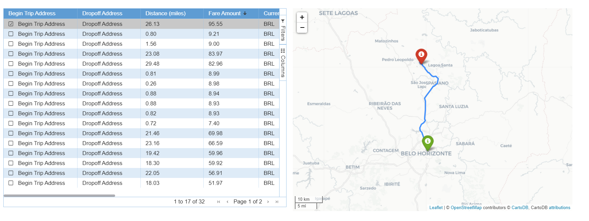

# Uber Data Export Dashboard



> Este projeto é voltado para a visualização de dados de um dataset Uber.
> 
### Ajustes e melhorias

O projeto ainda está em desenvolvimento e as próximas atualizações serão voltadas nas seguintes tarefas:

- [x] Tabela interativa com dados de viagens UberX
- [x] Visualização em mapa de viagem UberX
- [ ] Tabela interativa com dados de produtos Uber
- [ ] Visualização em mapa de produtos Uber por localização
- [ ] Visualização em gráfico de produtos Uber por localização, data e valor

## ☕ Usando Uber Data Export Dashboard

Para usar Uber Data Export Dashboard, siga estas etapas:

```
Baixe em (link) seu Uber dataset, coloque-o na mesma pasta do projeto e execute main.py
```

Adicione comandos de execução e exemplos que você acha que os usuários acharão úteis. Fornece uma referência de opções para pontos de bônus!


## 🤝 Colaboradores

Agradecemos às seguintes pessoas que contribuíram para este projeto:

<table>
  <tr>
    <td align="center">
      <a href="#">
        <br>
        <sub>
          <b>Julia Ferreira</b>
        </sub>
      </a>
    </td>
    <td align="center">
      <a href="#">
        <br>
        <sub>
          <b>João Neiva</b>
        </sub>
      </a>
    </td>
  </tr>
</table>

Saiba mais sobre mim no meu blog: https://juliakferreira.digitalpress.blog/
